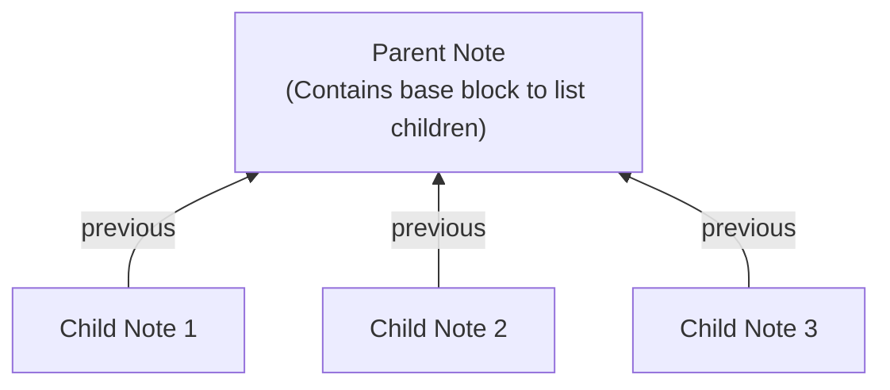

# Previous River

Previous River は Obsidian のノート同士に「前後関係」を持たせることができるプラグインです。

フロントマターの `previous` プロパティに **前のノートへのリンク** を設定することで、ノートを連続したシーケンスとして繋ぎ合わせることができます。これにより、流れに沿ったスムーズなナビゲーションや、ネットワーク全体像の可視化が可能になります。

## インストール

Obsidian の「設定」をクリックし、「コミュニティプラグイン」の「閲覧」から `previous river` で検索してください。

もしくは https://community.obsidian.md/plugins/previous-river からインストールしてください。

## 特徴

Previous River は `previous` プロパティを使ってノート同士を繋ぎ、主に **シーケンシャル（数珠繋ぎ）** と **階層構造** の2つの構造を構築できます。

### ノートを構造化する2つの方法

#### 1. シーケンシャル（数珠繋ぎ）構造 (従来)
ノートを前のノートにリンクすることで、連続したシーケンスを作成します。ジャーナルや手順書、思考の連なりなどに最適です。

#### 2. 階層構造 (1.4からの新機能)
複数の子ノートが `previous` プロパティを介して1つの親ノートを指すことで、親子構造を作成します。親ノート側で `Insert base to collect next notes` コマンドを使用することで、子ノートの一覧を動的に表示できます。

### その他の主要機能

#### 1. プロパティビューとの統合
Obsidian のプロパティビューから簡単に前後のノートに移動することができます。

現在のノートの `previous` プロパティ行の右端に **「next」ボタン** が自動的に表示され、クリックするだけで直感的に次のノートへと進むことができます。

前のノートに戻るときは `previous` プロパティに設定されたリンクをクリックします。

#### 2. Canvas へのネットワーク書き出し
繋がっているノート群をビジュアルなツリー構造として **Obsidian Canvas に書き出す** ことができます。
- 現在のノートから派生するすべての「次のノート」のツリー
- Vault 全体のすべての川（シーケンス）
- フィルタリングされた特定の川

これらを Canvas 上で簡単に俯瞰できます。また、ループ構造を自動的に検出し、起点のノートに `🔄` アイコンを付与するため、ネットワークの整合性確認にも役立ちます。

## コマンド一覧

### ナビゲーション
- **Go to previous note** (前のノートに移動):
  現在のノートの `previous` プロパティでリンクされたノートに移動します。
- **Go to next note** (次のノートに移動):
  現在のノートにバックリンクを持ち、かつその `previous` プロパティが現在のノートを指しているノートに移動します。候補が複数ある場合は、選択用のモーダルが表示されます。
- **Go to first note** (最初のノートに移動):
  `previous` プロパティのチェーンをたどり、シーケンス内の最初の（源流となる）ノートに移動します。
- **Go to last note** (最後のノートに移動):
  次のノートをたどり、シーケンス内の最後のノートに移動します。候補が複数ある場合は、選択用のモーダルが表示されます。

### ノートの操作・編集
- **Insert note** (ノートの挿入):
  選択したノートを現在の連続したシーケンスの間に挿入します。
- **Insert note to first** (先頭に挿入):
  選択したノートを現在のシーケンスの先頭に挿入します。
- **Insert note to last** (末尾に挿入):
  選択したノートを現在のシーケンスの末尾に挿入します。
- **Duplicate next note** (次のノートとして複製):
  現在アクティブなノートを複製し、新しいノートの `previous` プロパティを元のノートに自動的に設定して繋げます。（※既存のノート間に挿入したい場合は、代わりに「Insert note」コマンドを使用してください。）
- **Detach note** (ノートの切り離し):
  現在のノートの `previous` プロパティを `ROOT` に設定することで、シーケンスから切り離します。
- **Set ROOT to previous property** (ROOT の設定):
  アクティブなノートの `previous` プロパティに `ROOT` をすばやく設定します。
- **Set note to previous property** (前のノートとして設定):
  選択した既存のノートを、現在のノートの `previous` プロパティに設定します。
- **Create next note** (次のノートを作成):
  新しい空のノートを作成し、その `previous` プロパティに現在のノートを自動的に設定します。（※既存のノート間に挿入したい場合は、代わりに「Insert note」コマンドを使用してください。）
- **Insert base to collect next notes** (次のノートを収集するbaseブロックを挿入):
  現在のノートを `previous` に設定しているノートの一覧を動的に表示するためのコードブロックを挿入します。

### エクスポートと共有
- **Copy next notes list** (次のノート一覧をコピー):
  現在のノートから続く「次のノート」のシーケンスをクリップボードにコピーします。分岐がある場合は、自動的にツリー構造のテキストリストとしてフォーマットされます。
- **Export next notes to canvas** (次のノートをCanvasへ書き出し):
  現在のノートから派生する「次のノート」のツリー構造全体を Obsidian Canvas に書き出します。
- **Export all rivers to canvas** (すべての川をCanvasへ書き出し):
  Vault 全体の `previous` プロパティの繋がりを解析し、ネットワーク全体を Canvas ファイルとして書き出します。
- **Export filtered rivers to canvas** (フィルタリングした川をCanvasへ書き出し):
  特定の条件でフィルタリングされたノートのネットワークのサブセットを Canvas に書き出します。

## おすすめのホットキー

シーケンスを前後にたどる操作は、ホットキーを設定しておくと非常に快適になります。

- **Go to previous note**: `Alt+,`
- **Go to next note**: `Alt+.`
- **Go to first note**: `Alt+Shift+,`
- **Go to last note**: `Alt+Shift+.`
