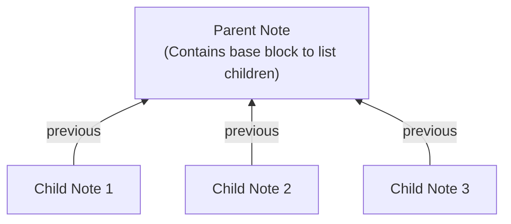

# Previous River

Previous River is an Obsidian plugin that adds sequential relationships to your notes.

By setting a **link to the previous note** in the `previous` frontmatter property, you can connect notes into a continuous sequence. This enables smooth navigation along the flow and visualization of the entire network structure.

## Installation

Open **Settings** in Obsidian, click on **Browse** under **Community plugins**, and search for `previous river`.

Alternatively, install it directly from [https://community.obsidian.md/plugins/previous-river](https://community.obsidian.md/plugins/previous-river).

## Features

Previous River uses the `previous` property to connect notes, allowing you to build two primary structures: **Sequential** and **Hierarchical**.

### Two Ways to Structure Your Notes

#### 1. Sequential Notes (Classic)
Connect notes in a continuous sequence by linking each note to its predecessor. This is ideal for journals, step-by-step guides, or a chain of thought.

#### 2. Hierarchical Notes (New in 1.4)
Create a parent-child structure by having multiple child notes point to a single parent note via the `previous` property. You can then use the `Insert base to collect next notes` command in the parent note to display a dynamically updated list of all its children.

### Other Core Features

#### 1. Integration with the Properties view
Easily navigate to previous and next notes directly from the Obsidian Properties view.

A **next button** automatically appears on the right edge of the `previous` property row in the current note. Click it to intuitively advance to the next note.

To return to the previous note, click the link set in the `previous` property.

#### 2. Export networks to Canvas
You can **export connected notes to an Obsidian Canvas** as a visual tree structure.
- The tree of all "next notes" branching from the current note
- All rivers (sequences) across the entire Vault
- Specifically filtered rivers

This provides an easy overview on the Canvas. It also automatically detects loop structures and adds a `🔄` icon to the origin note, helping you verify network integrity.

## Commands

### Navigation
- **Go to previous note**:
  Navigate to the note linked in the current note's `previous` property.
- **Go to next note**:
  Navigate to a note that backlinks to the current note and has its `previous` property pointing to it. If multiple candidates exist, a selection modal appears.
- **Go to first note**:
  Follow the `previous` property chain to reach the first (source) note in the sequence.
- **Go to last note**:
  Follow the next notes to reach the last note in the sequence. If multiple candidates exist, a selection modal appears.

### Note operations
- **Insert note**:
  Insert the selected note into the current continuous sequence.
- **Insert note to first**:
  Insert the selected note at the beginning of the current sequence.
- **Insert note to last**:
  Insert the selected note at the end of the current sequence.
- **Duplicate next note**:
  Duplicate the currently active note and automatically link it by setting the new note's `previous` property to the original note. (Note: To insert a note between existing notes, use the "Insert note" command instead.)
- **Detach note**:
  Detach the current note from the sequence by setting its `previous` property to `ROOT`.
- **Set ROOT to previous property**:
  Quickly set the `previous` property of the active note to `ROOT`.
- **Set note to previous property**:
  Set an existing note to the current note's `previous` property.
- **Create next note**:
  Create a new empty note and automatically set its `previous` property to the current note. (Note: To insert a note between existing notes, use the "Insert note" command instead.)
- **Insert base to collect next notes**:
  Insert a code block to dynamically list all notes that point to the current note via the `previous` property.

### Export and sharing
- **Copy next notes list**:
  Copy the sequence of "next notes" following the current note to the clipboard. Branches are automatically formatted as a text-based tree list.
- **Export next notes to canvas**:
  Export the entire tree structure of "next notes" branching from the current note to an Obsidian Canvas.
- **Export all rivers to canvas**:
  Analyze `previous` property connections across the entire Vault and export the whole network as a Canvas file.
- **Export filtered rivers to canvas**:
  Export a subset of the note network filtered by specific conditions to a Canvas.

## Recommended Hotkeys

Setting hotkeys for navigating sequences back and forth significantly improves usability.

- **Go to previous note**: `Alt+,`
- **Go to next note**: `Alt+.`
- **Go to first note**: `Alt+Shift+,`
- **Go to last note**: `Alt+Shift+.`

## Contributing

Feel free to submit bug reports and feature requests via Issues. Contributions through pull requests are also highly appreciated!